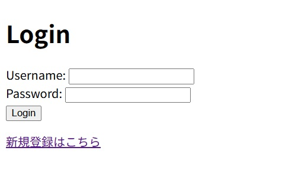
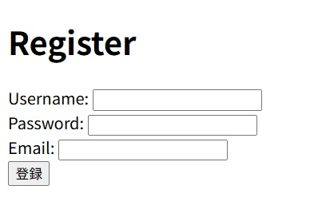
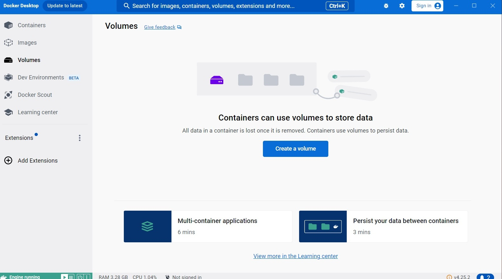
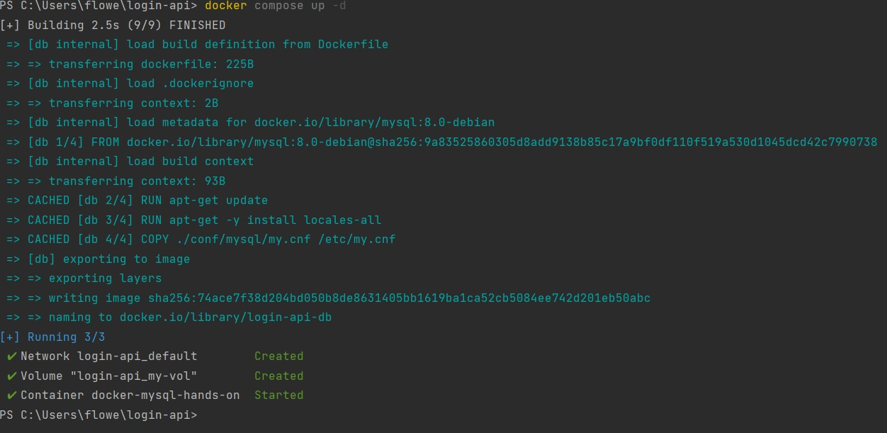
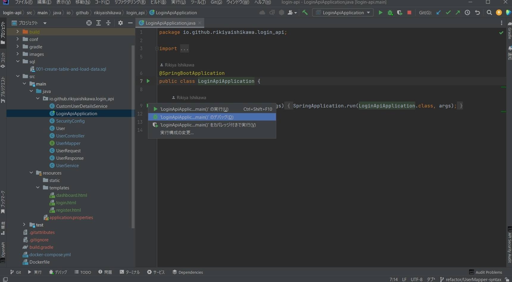
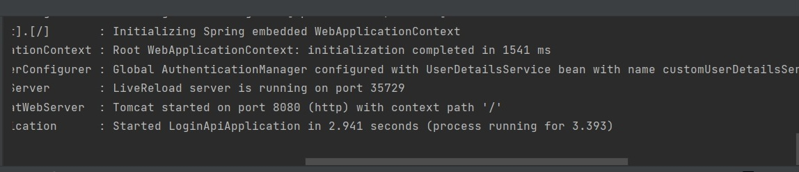

# ユーザー認証システム

## 概要
本アプリケーションは、ユーザー登録機能とログイン認証機能を最小限の構成で実装したシンプルな認証システムです。

## 使用技術
- 使用言語:	Java
- Webアプリケーションフレームワーク:	Spring Boot
- O/Rマッパー:	MyBatis
- 認証・認可ライブラリ:	Spring Security
- テンプレートエンジン:	Thymeleaf
- ビルドツール:	Gradle (記述言語: Groovy)
- コンテナ仮想化技術 / 実行環境:	Docker(MySQL)
- 開発環境 (IDE):	IntelliJ IDEA
- データベース:	MySQL
- その他ツール:	Git / GitHub 

## 機能一覧
- フォームからリクエストを受け取り、ユーザ名、パスワード(ハッシュ化)、Emailを入力して登録ボタンを押す事でDBに保存される
- Spring Securityのフィルター機能とform認証を使用して、フォームに入力された情報とDBに保存された情報を照合する
- ログインに成功するとdashboardに遷移する
- パスワードには、Spring Securityが提供する Bcrypt などの強力なハッシュ関数を適用し、安全性を確保。
- Spring Security の Custom UserDetailsService を実装し、DBのユーザー情報と連携。

## 画面イメージ

## 環境構築(起動手順)
- gitHubからリポジトリをクローン
- git pullとgit checkoutを実行
- dockerDesktopをあらかじめ起動しておく

- docker compose up -dを実行

- LoginApiApplication.javaのmain()を実行

- Applicationの起動を確認

- chromeのアドレスバーにlocalhost:8080/loginを入力してエンター

- ログインを確認

## 設計
- クライアント層:
  - ユーザーの操作を受け付けます。主にThymeleafで構築されたHTMLテンプレートを使用します。
- アプリケーション層 (Web/Service):
  - Controller: クライアントからのリクエストを受け取り、レスポンスを返します。
  - Service: 業務ロジック（データの加工、検証、認証処理など）を記述します。
- データ層 (Persistence):
  - Repository / MyBatis: データベースとのやり取りを担います。MyBatisを使用してSQLとのマッピングを行います。
  - Database: 開発環境ではMySQLを使用し、永続化されたデータを管理します。

## 工夫した点 / 苦労した点
- 公式ドキュメントの何処を見たらいいかわからない
- 公式ドキュメントの表現が難しくて、内容が理解できない
- 時間が限られた中でどこまで実装するか悩んだ
- REST APIとThymeleafを使ったフロントありきの実装が混ざってしまい、修正すのに時間がかかった
- 環境構築の仕方を忘れてしまい、調べなおすのに時間がかかった
- dockerコマンドを忘れてしまい、思い出すのに苦労した
- 生成AIに嘘をつかれて、エビデンスの確認に時間がかかった
- 実装方法が複数存在してどの方法を採用するか悩んだ
- 参考にしたWEBページの開発環境が違う事が多く、自分の環境用にカスタマイズするのに苦労した

## 今後の改善点
- REST API化する
- ログアウト機能を実装する
- バリデーションの追加
- ログイン成功・失敗後のページの作りこみ
- フロントエンドのデザインやJavaScriptによる挙動の追加
- 管理者権限と一般ユーザの分岐(管理者ページや、権限によって遷移先を変える)
- テスト仕様書の作成
- Junitを使った単体、DB、結合の各テストの実装
- セキュリティに対する機能の実装
